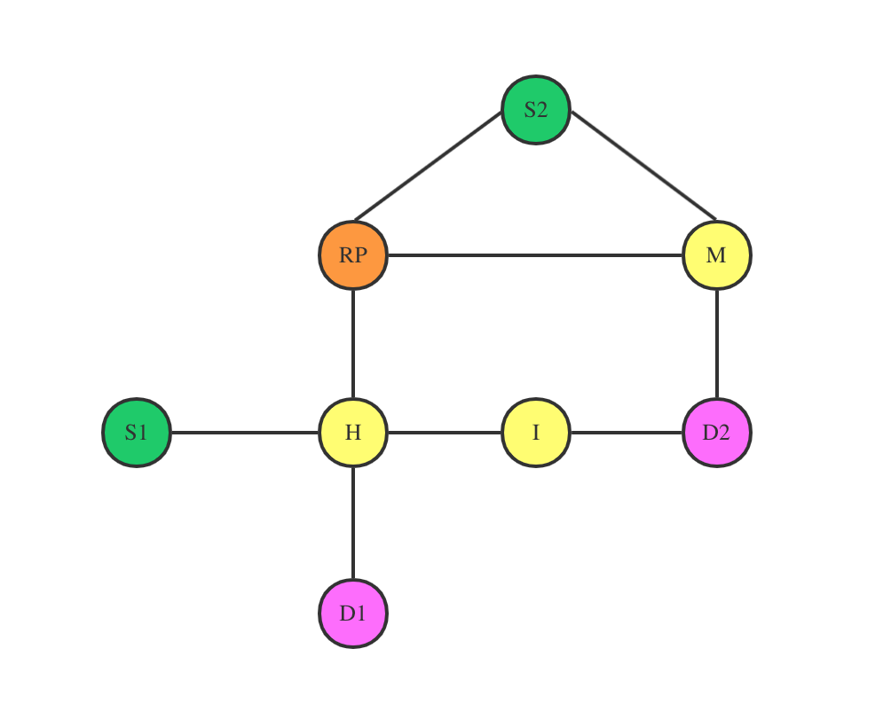

# Switchover

Switchover in PIM-Spare Mode

# Structure

- src: source files 
- target: jar and config files

## Usage

```shell
java -jar Switchover-1.0-jar-with-dependencies.jar [router_id]
```

router_id:

- defined in config file
- 1 by default

The files below have to be in the same folder:

```
- Switchover-1.0-jar-with-dependencies.jar
- config.json
```

## Configuration

```json
{
  "shutdown_timer": 120,
  "routers": {
    "1": {
      "id": 1,
      "ip": "ip1",
      "port": 23901,
      "name": "RP",
      "neighbors": [
        2,
        6,
        8
      ],
      "routingTable": {
        "2": 2,
        "3": 2,
        "4": 2,
        "5": 2,
        "6": 6,
        "7": 6
      }
    },
    "2": {
      "id": 2,
      "ip": "ip2",
      "port": 23902,
      "name": "H",
      "neighbors": [
        1,
        3,
        4,
        5
      ],
      "routingTable": {
        "1": 1,
        "3": 3,
        "4": 4,
        "5": 5,
        "6": 1,
        "7": 5,
        "8": 1
      }
    },
    "3": {
      "id": 3,
      "ip": "ip3",
      "port": 23903,
      "name": "D1",
      "neighbors": [
        2
      ],
      "routingTable": {
        "1": 2,
        "2": 2,
        "4": 2,
        "5": 2,
        "6": 2,
        "7": 2,
        "8": 2
      },
      "actions": {
        "5": {
          "type": "JOIN",
          "groupId": 1
        },
        "14": {
          "type": "SWITCHOVER",
          "groupId": 1,
          "content": "4"
        }
      }
    },
    "4": {
      "id": 4,
      "ip": "ip4",
      "port": 23904,
      "name": "S1",
      "neighbors": [
        2
      ],
      "routingTable": {
        "1": 2,
        "2": 2,
        "3": 2,
        "5": 2,
        "6": 2,
        "7": 2,
        "8": 2
      },
      "actions": {
        "7": {
          "type": "MULTICAST",
          "groupId": 1,
          "content": "S1's first message"
        },
        "12": {
          "type": "MULTICAST",
          "groupId": 1,
          "content": "S1's second message"
        },
        "17": {
          "type": "MULTICAST",
          "groupId": 1,
          "content": "S1's third message"
        }
      }
    },
    "5": {
      "id": 5,
      "ip": "ip5",
      "port": 23905,
      "name": "I",
      "neighbors": [
        2,
        7
      ],
      "routingTable": {
        "1": 2,
        "2": 2,
        "3": 2,
        "4": 2,
        "6": 7,
        "7": 7,
        "8": 7
      }
    },
    "6": {
      "id": 6,
      "ip": "ip6",
      "port": 23906,
      "name": "M",
      "neighbors": [
        1,
        7,
        8
      ],
      "routingTable": {
        "1": 1,
        "2": 1,
        "3": 1,
        "4": 1,
        "5": 7,
        "7": 7,
        "8": 8
      }
    },
    "7": {
      "id": 7,
      "ip": "ip7",
      "port": 23907,
      "name": "D2",
      "neighbors": [
        5,
        6
      ],
      "routingTable": {
        "1": 6,
        "2": 5,
        "3": 5,
        "4": 5,
        "5": 5,
        "6": 6,
        "8": 6
      },
      "actions": {
        "5": {
          "type": "JOIN",
          "groupId": 1
        },
        "9": {
          "type": "SWITCHOVER",
          "groupId": 1,
          "content": "4"
        }
      }
    },
    "8": {
      "id": 8,
      "ip": "ip8",
      "port": 23908,
      "name": "S2",
      "neighbors": [
        1,
        6
      ],
      "routingTable": {
        "1": 1,
        "2": 1,
        "3": 1,
        "4": 1,
        "5": 6,
        "6": 6,
        "7": 6
      },
      "actions": {
        "7": {
          "type": "MULTICAST",
          "groupId": 1,
          "content": "S2's first message"
        },
        "12": {
          "type": "MULTICAST",
          "groupId": 1,
          "content": "S2's second message"
        }
      }
    }
  }
}
```

### Topology



### Routers

- Sources: S1, S2

- Rendezvous Point: RP

- Subscribers: D1, D2

### Process

- D1 and D2 join RP
- S1 multicast Message S1_1
- S2 multicast Message S2_1
- D2 join S1(switchover)
- S1 multicast Message S1_2
- D1 join S1(switchover)
- S1 multicast Message S1_3
- S2 multicast Message S2_2

## Main Idea

### Router

- A router holds a TCP channel which works like a server, waiting for clients to connect.
- A router connect to all its neighbors as a client.

### Group-shared tree

- A subscriber sends a JOIN message to RP hop by hop.
- If a router is already in the tree, drop the packet, else join the tree and pass the message to next hop.

### Source-based tree

- A subscriber sends a JOIN message to the source hop by hop like group-shared tree.
- A subscriber sends a PRUNE message to RP for a certain source.
- If all the successors of a router in the group-shared tree are pruned, the router sends PRUNE message to the next hop to RP.
- When all neighbors of RP in the group-shared tree are pruned for a certain source, RP send REVERSE TUNNEL message to the source.

### Multicast

- A source sends message to all the neighbors in the source-based tree.
- If a source hasn't received REVERSE TUNNEL message, it sends a copy to RP, and RP will flood the group-shared tree.

## Depedencies

- [Netty](https://netty.io/): network application framework 
- [Protobuf](https://developers.google.com/protocol-buffers): binary packet serialization/deserialization
- [Gson](https://github.com/google/gson): json serialization/deserialization

## Analyses

- D1 and D2 join RP
  - JOIN: D1->H->RP
  - JOIN: D2->M->RP
- S1 multicast Message S1_1
  - MULTICAST_TUNNELING: S1->H->RP
  - MULTICAST_FLOODING: RP->H->D1; RP->M->D2(group-shared tree rooted at RP)
- S2 multicast Message S2_1
  - MULTICAST_TUNNELING: S2->RP
  - MULTICAST_FLOODING: RP->H->D1; RP->M->D2(group-shared tree rooted at RP)
- D2 join S1(switchover)
  - PRUNE: D2->M->RP
  - JOIN: D2->I->H->S1
- S1 multicast Message S1_2
  - MULTICAST_TUNNELING: S1->H->RP
  - MULTICAST_FLOODING: RP->H->D1(group-shared tree rooted at RP)
  - MULTICAST_FLOODING: S1->H->I->D2(source-based tree rooted at S1)
- D1 join S1(switchover)
  - PRUNE: D1->H->RP
  - JOIN: D1->H->S1
- S1 multicast Message S1_3
  - MULTICAST_FLOODING: S1->H->D1(source-based tree rooted at S1)
  - MULTICAST_FLOODING: S1->H->I->D2(source-based tree rooted at S1)
- S2 multicast Message S2_2
  - MULTICAST_TUNNELING: S2->RP
  - MULTICAST_FLOODING: RP->H->D1; RP->M->D2(group-shared tree rooted at RP)

## Appendix

### Logs

#### router_1: ip1

```
{dc01:~} java -jar Switchover-1.0-jar-with-dependencies.jar
14:58:40>> Router 1(RP) start
14:58:40>> Router 1(RP) running
14:58:42>> Router 1(RP) success: ip2
14:58:46>> Router 1(RP) success: ip6
14:58:48>> Router 1(RP) success: ip8
14:58:48>> Router 1(RP) initialized
14:59:09>> Router 1(RP) Receive JOIN: K->H->RP
14:59:12>> Router 1(RP) Receive JOIN: D2->M->RP
14:59:19>> Router 1(RP) Receive MULTICAST_TUNNELING: S1->H->RP
14:59:19>> Router 1(RP) Send MULTICAST_FLOODING to H
14:59:19>> Router 1(RP) Send MULTICAST_FLOODING to M
14:59:19>> Router 1(RP) succeeded
14:59:19>> Router 1(RP) succeeded
14:59:23>> Router 1(RP) Receive MULTICAST_TUNNELING: S2->RP
14:59:23>> Router 1(RP) Send MULTICAST_FLOODING to H
14:59:23>> Router 1(RP) Send MULTICAST_FLOODING to M
14:59:23>> Router 1(RP) succeeded
14:59:23>> Router 1(RP) succeeded
14:59:32>> Router 1(RP) Receive PRUNE: D2->M->RP
14:59:44>> Router 1(RP) Receive MULTICAST_TUNNELING: S1->H->RP
14:59:44>> Router 1(RP) Send MULTICAST_FLOODING to H
14:59:44>> Router 1(RP) Send MULTICAST_FLOODING to M
14:59:44>> Router 1(RP) succeeded
14:59:44>> Router 1(RP) succeeded
14:59:48>> Router 1(RP) Receive MULTICAST_TUNNELING: S2->RP
14:59:48>> Router 1(RP) Send MULTICAST_FLOODING to H
14:59:48>> Router 1(RP) Send MULTICAST_FLOODING to M
14:59:48>> Router 1(RP) succeeded
14:59:48>> Router 1(RP) succeeded
14:59:53>> Router 1(RP) Receive PRUNE: K->H->RP
14:59:53>> Router 1(RP) Send REVERSE_TUNNELING to H
14:59:53>> Router 1(RP) succeeded
```

#### router_2: ip2

```
{dc02:~} java -jar Switchover-1.0-jar-with-dependencies.jar 2
14:58:42>> Router 2(H) start
14:58:42>> Router 2(H) running
14:58:42>> Router 2(H) success: ip1
14:58:43>> Router 2(H) success: ip3
14:58:44>> Router 2(H) success: ip4
14:58:45>> Router 2(H) success: ip5
14:58:45>> Router 2(H) initialized
14:59:08>> Router 2(H) Receive JOIN: D1->H
14:59:08>> Router 2(H) Send JOIN to RP
14:59:08>> Router 2(H) succeeded
14:59:19>> Router 2(H) Receive MULTICAST_TUNNELING: S1->H
14:59:19>> Router 2(H) Send MULTICAST_TUNNELING to RP
14:59:19>> Router 2(H) succeeded
14:59:19>> Router 2(H) Receive MULTICAST_FLOODING: S1->H->RP->H
14:59:19>> Router 2(H) Send MULTICAST_FLOODING to D1
14:59:19>> Router 2(H) succeeded
14:59:23>> Router 2(H) Receive MULTICAST_FLOODING: S2->RP->H
14:59:23>> Router 2(H) Send MULTICAST_FLOODING to D1
14:59:23>> Router 2(H) succeeded
14:59:32>> Router 2(H) Receive JOIN: D2->I->H
14:59:32>> Router 2(H) Send JOIN to S1
14:59:32>> Router 2(H) succeeded
14:59:44>> Router 2(H) Receive MULTICAST_TUNNELING: S1->H
14:59:44>> Router 2(H) Send MULTICAST_TUNNELING to RP
14:59:44>> Router 2(H) Receive MULTICAST_FLOODING: S1->H
14:59:44>> Router 2(H) Send MULTICAST_FLOODING to I
14:59:44>> Router 2(H) succeeded
14:59:44>> Router 2(H) succeeded
14:59:44>> Router 2(H) Receive MULTICAST_FLOODING: S1->H->RP->H
14:59:44>> Router 2(H) Send MULTICAST_FLOODING to I
14:59:44>> Router 2(H) succeeded
14:59:48>> Router 2(H) Receive MULTICAST_FLOODING: S2->RP->H
14:59:48>> Router 2(H) Send MULTICAST_FLOODING to D1
14:59:48>> Router 2(H) succeeded
14:59:53>> Router 2(H) Receive JOIN: D1->H
14:59:53>> Router 2(H) Receive PRUNE: D1->H
14:59:53>> Router 2(H) Send PRUNE to RP
14:59:53>> Router 2(H) succeeded
14:59:53>> Router 2(H) Receive REVERSE_TUNNELING: RP->H
14:59:53>> Router 2(H) Send REVERSE_TUNNELING to S1
14:59:53>> Router 2(H) succeeded
15:00:09>> Router 2(H) Receive MULTICAST_FLOODING: S1->H
15:00:09>> Router 2(H) Send MULTICAST_FLOODING to D1
15:00:09>> Router 2(H) Send MULTICAST_FLOODING to I
15:00:09>> Router 2(H) succeeded
15:00:09>> Router 2(H) succeeded
```

#### router_3: ip3

```
{dc03:~} java -jar Switchover-1.0-jar-with-dependencies.jar 3
14:58:43>> Router 3(D1) start
14:58:43>> Router 3(D1) running
14:58:43>> Router 3(D1) success: ip2
14:58:43>> Router 3(D1) initialized
14:59:08>> Router 3(D1) Send JOIN to H
14:59:08>> Router 3(D1) succeeded
14:59:19>> Router 3(D1) Receive MULTICAST_FLOODING: S1->H->RP->H->D1
14:59:19>> Router 3(D1) Unpack multicast message form 4: S1's first message
14:59:23>> Router 3(D1) Receive MULTICAST_FLOODING: S2->RP->H->D1
14:59:23>> Router 3(D1) Unpack multicast message form 8: S2's first message
14:59:48>> Router 3(D1) Receive MULTICAST_FLOODING: S2->RP->H->D1
14:59:48>> Router 3(D1) Unpack multicast message form 8: S2's second message
14:59:53>> Router 3(D1) Send JOIN to H
14:59:53>> Router 3(D1) Send PRUNE to H
14:59:53>> Router 3(D1) succeeded
14:59:53>> Router 3(D1) succeeded
15:00:09>> Router 3(D1) Receive MULTICAST_FLOODING: S1->H->D1
15:00:09>> Router 3(D1) Unpack multicast message form 4: S1's third message
15:00:43>> Router 3(D1) Close channel.
```

#### router_4: ip4

```
{dc04:~} java -jar Switchover-1.0-jar-with-dependencies.jar 4
14:58:44>> Router 4(S1) start
14:58:44>> Router 4(S1) running
14:58:44>> Router 4(S1) success: ip2
14:58:44>> Router 4(S1) initialized
14:59:19>> Router 4(S1) Send MULTICAST_TUNNELING to H
14:59:19>> Router 4(S1) succeeded
14:59:32>> Router 4(S1) Receive JOIN: D2->I->H->S1
14:59:44>> Router 4(S1) Send MULTICAST_TUNNELING to H
14:59:44>> Router 4(S1) Send MULTICAST_FLOODING to H
14:59:44>> Router 4(S1) succeeded
14:59:44>> Router 4(S1) succeeded
14:59:53>> Router 4(S1) Receive REVERSE_TUNNELING: RP->H->S1
15:00:09>> Router 4(S1) Send MULTICAST_FLOODING to H
15:00:09>> Router 4(S1) succeeded
```

#### router_5: ip5

```
{dc05:~} java -jar Switchover-1.0-jar-with-dependencies.jar 5
14:58:45>> Router 5(I) start
14:58:45>> Router 5(I) running
14:58:45>> Router 5(I) success: ip2
14:58:47>> Router 5(I) success: ip7
14:58:47>> Router 5(I) initialized
14:59:32>> Router 5(I) Receive JOIN: D2->I
14:59:32>> Router 5(I) Send JOIN to H
14:59:32>> Router 5(I) succeeded
14:59:44>> Router 5(I) Receive MULTICAST_FLOODING: S1->H->I
14:59:44>> Router 5(I) Send MULTICAST_FLOODING to D2
14:59:44>> Router 5(I) succeeded
14:59:44>> Router 5(I) Receive MULTICAST_FLOODING: S1->H->RP->H->I
14:59:44>> Router 5(I) Send MULTICAST_FLOODING to D2
14:59:44>> Router 5(I) succeeded
15:00:09>> Router 5(I) Receive MULTICAST_FLOODING: S1->H->I
15:00:09>> Router 5(I) Send MULTICAST_FLOODING to D2
15:00:09>> Router 5(I) succeeded
```

#### router_6: ip6

```
{dc06:~} java -jar Switchover-1.0-jar-with-dependencies.jar 6
14:58:46>> Router 6(M) start
14:58:46>> Router 6(M) running
14:58:46>> Router 6(M) success: ip1
14:58:47>> Router 6(M) success: ip7
14:58:48>> Router 6(M) success: ip8
14:58:48>> Router 6(M) initialized
14:59:12>> Router 6(M) Receive JOIN: D2->M
14:59:12>> Router 6(M) Send JOIN to RP
14:59:12>> Router 6(M) succeeded
14:59:19>> Router 6(M) Receive MULTICAST_FLOODING: S1->H->RP->M
14:59:19>> Router 6(M) Send MULTICAST_FLOODING to D2
14:59:19>> Router 6(M) succeeded
14:59:23>> Router 6(M) Receive MULTICAST_FLOODING: S2->RP->M
14:59:23>> Router 6(M) Send MULTICAST_FLOODING to D2
14:59:23>> Router 6(M) succeeded
14:59:32>> Router 6(M) Receive PRUNE: D2->M
14:59:32>> Router 6(M) {1={1={4=[7]}}}
14:59:32>> Router 6(M) Send PRUNE to RP
14:59:32>> Router 6(M) succeeded
14:59:44>> Router 6(M) Receive MULTICAST_FLOODING: S1->H->RP->M
14:59:44>> Router 6(M) Send MULTICAST_FLOODING to D2
14:59:44>> Router 6(M) succeeded
14:59:48>> Router 6(M) Receive MULTICAST_FLOODING: S2->RP->M
14:59:48>> Router 6(M) Send MULTICAST_FLOODING to D2
14:59:48>> Router 6(M) succeeded
```

#### router_7: ip7

```
{dc07:~} java -jar Switchover-1.0-jar-with-dependencies.jar 7
14:58:47>> Router 7(D2) start
14:58:47>> Router 7(D2) running
14:58:47>> Router 7(D2) success: ip5
14:58:47>> Router 7(D2) success: ip6
14:58:47>> Router 7(D2) initialized
14:59:12>> Router 7(D2) Send JOIN to M
14:59:12>> Router 7(D2) succeeded
14:59:19>> Router 7(D2) Receive MULTICAST_FLOODING: S1->H->RP->M->D2
14:59:19>> Router 7(D2) Unpack multicast message form 4: S1's first message
14:59:23>> Router 7(D2) Receive MULTICAST_FLOODING: S2->RP->M->D2
14:59:23>> Router 7(D2) Unpack multicast message form 8: S2's first message
14:59:32>> Router 7(D2) Send JOIN to I
14:59:32>> Router 7(D2) Send PRUNE to M
14:59:32>> Router 7(D2) succeeded
14:59:32>> Router 7(D2) succeeded
14:59:44>> Router 7(D2) Receive MULTICAST_FLOODING: S1->H->I->D2
14:59:44>> Router 7(D2) Unpack multicast message form 4: S1's second message
14:59:44>> Router 7(D2) Receive MULTICAST_FLOODING: S1->H->RP->M->D2
14:59:44>> Router 7(D2) Receive MULTICAST_FLOODING: S1->H->RP->H->I->D2
14:59:44>> Router 7(D2) Unpack multicast message form 4: S1's second message
14:59:44>> Router 7(D2) Unpack multicast message form 4: S1's second message
14:59:48>> Router 7(D2) Receive MULTICAST_FLOODING: S2->RP->M->D2
14:59:48>> Router 7(D2) Unpack multicast message form 8: S2's second message
15:00:09>> Router 7(D2) Receive MULTICAST_FLOODING: S1->H->I->D2
15:00:09>> Router 7(D2) Unpack multicast message form 4: S1's third message
15:00:47>> Router 7(D2) Close channel.
```

#### router_8: ip8

```
{dc08:~} java -jar Switchover-1.0-jar-with-dependencies.jar 8
14:58:48>> Router 8(S2) start
14:58:48>> Router 8(S2) running
14:58:48>> Router 8(S2) success: ip1
14:58:48>> Router 8(S2) success: ip6
14:58:48>> Router 8(S2) initialized
14:59:23>> Router 8(S2) Send MULTICAST_TUNNELING to RP
14:59:23>> Router 8(S2) succeeded
14:59:48>> Router 8(S2) Send MULTICAST_TUNNELING to RP
14:59:48>> Router 8(S2) succeeded
```

